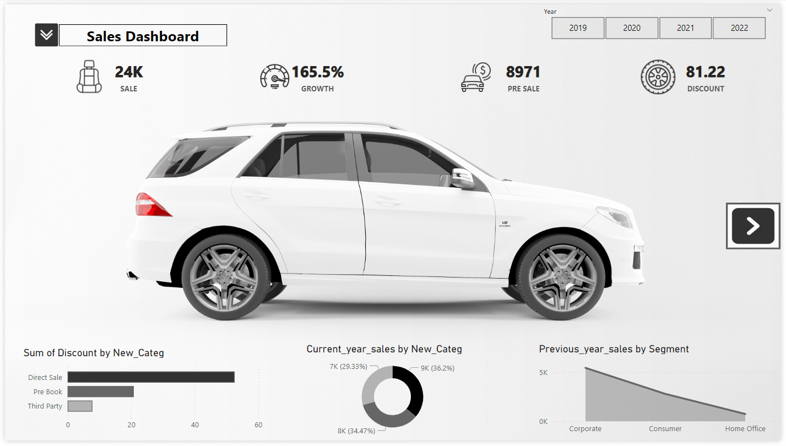
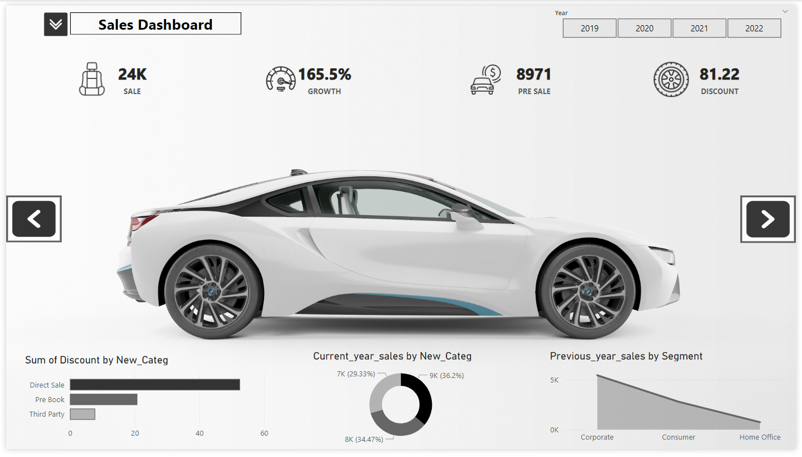
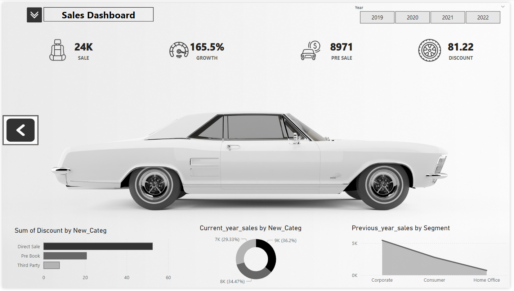

# Car Sales Analysis Power BI Dashboard

This repository offers a visually compelling Power BI dashboard for in-depth car-sales analysis.

# Key Features:
# Pre-built Dashboard:
A stunning Power BI dashboard populated with your sales data, ready for immediate insights. (The included .pbix file)

# Data Source:
A sample Excel spreadsheet (likely included) provides a foundation for your own data import. Informative Visualizations: Pictures of cars,  pie charts, line charts, and data cards to explore sales trends, identify top performers, and uncover hidden patterns.

# Benefits:
Gain Clear Sales Insights: Effortlessly visualize car-sales performance across various dimensions.

# Data-Driven Decision Making:
Make informed business decisions based on clear trends and visualizations.

# Customization Ready:
Easily replace the sample data with your own and tailor the dashboard to your specific needs.

# Getting Started:
Clone the repository from GitHub. Import your sales data into the provided Excel sheet (if applicable). Open the .pbix file in Power BI Desktop. Explore the interactive dashboard and gain valuable insights into your sales performance.

# Power Bi | Car-sales-report | Dashboard | Data analysis | Data visualization
